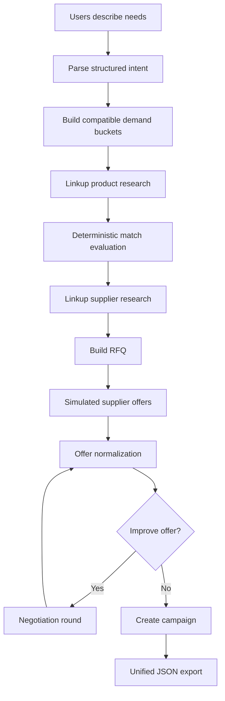

# Claude Code Build Instructions: SYE Agentic Demand Aggregation MVP

## 0. Your role

You are Claude Code acting as the lead engineer for an MVP of an AI-native demand aggregation and collective-buying platform.

Build a working local project, not a design-only prototype.

The **most important deliverable is DEMO MODE**: we must be able to provide several sample users, each with a natural-language description of the monitor they want, run the system end-to-end, and inspect a complete audit trail showing how the system:

1. parsed each user request,
2. normalized requirements,
3. grouped compatible users,
4. researched candidate monitors on the live web,
5. evaluated candidates against each group's requirements,
6. researched potential suppliers,
7. generated/simulated supplier offers,
8. negotiated offers in simulation,
9. selected the best qualifying deal,
10. created a complete campaign object,
11. exported all resulting data in one unified JSON format ready for a Lovable frontend.

Do not overbuild production infrastructure. Optimize for a hackathon-quality demo that is easy to run, inspect, explain, and later connect to a Lovable website.

---

# 1. Product context

The product reverses normal ecommerce.

Instead of a retailer selecting a product and finding buyers, consumers first describe what they need. The system converts their natural-language needs into structured requirements, groups users with overlapping constraints, finds products that satisfy those groups, aggregates the demand, and then lets suppliers compete to fulfill that demand.

Core mechanism:

> Aggregate compatible demand first, then source and negotiate supply around it.

Initial demo category: **computer monitors**.

Example:

- User A: "I need a monitor larger than 24 inches, mostly for work."
- User B: "I need at least 1080p and USB-C/Thunderbolt for my MacBook."
- User C: "I want something under €200 with FreeSync."

The system should determine whether these users can belong to one compatible demand bucket, identify monitors that satisfy the combined constraints, discover sellers/suppliers, simulate or later conduct collective-buy negotiation, and produce a campaign.

The MVP is primarily a demonstration of the long-term AI workflow. Real payments, legally binding supplier outreach, inventory reservation, order routing, and fulfillment are **not required** for the demo.

---

# 2. Required technology choices

Use these unless there is a concrete incompatibility:

## Backend

- Python 3.12+
- FastAPI
- Pydantic v2
- LangGraph
- LangChain model abstractions only where useful
- `uv` for Python dependency/project management
- SQLite for local persistent demo storage
- SQLAlchemy or SQLModel for simple persistence
- pytest

## LLM

Design behind a small provider abstraction.

Default implementation may use Anthropic through LangChain, but do not tightly couple business logic to one LLM.

Environment variable examples:

```bash
ANTHROPIC_API_KEY=
OPENAI_API_KEY=
LLM_PROVIDER=anthropic
LLM_MODEL=
```

Structured outputs are mandatory for every LLM step that creates business data.

## Internet research

Use **Linkup** for every runtime stage that needs access to the public internet.

Docs:

- https://www.linkup.so/
- https://docs.linkup.so/
- https://github.com/LinkupPlatform/linkup-for-agents

Set up:

```bash
LINKUP_API_KEY=
```

Use the official SDK where possible.

For normal product/supplier discovery use Linkup Search with:

- `depth="standard"` for most searches,
- `depth="deep"` only when the task actually needs multi-step search,
- `output_type="structured"` when converting web research directly into our domain schema,
- source inclusion enabled where supported.

Do **not** build custom Google/Bing scraping.

## Frontend compatibility

Do not build the final Lovable frontend.

Instead build a clean, versioned REST API and JSON export contract so Lovable can consume the results later with minimal mapping.

A tiny local demo viewer is optional, but the backend demo must work without it.

---

# 3. Non-negotiable engineering principles

## 3.1 Typed data between every stage

Agents must never pass important business state as free-form prose.

Every graph node must read typed state and write typed Pydantic models.

Free-form reasoning may exist internally, but the output crossing a node boundary must validate against a schema.

## 3.2 One canonical domain model

Do not create subtly different versions of "product", "user intent", "offer", or "campaign" per agent.

Define canonical Pydantic domain models in one module and use them everywhere:

```text
src/sye/domain/
```

These models are the contract between:

- agents,
- LangGraph state,
- database,
- API,
- simulation,
- Lovable frontend.

## 3.3 Deterministic logic where possible

Do not ask an LLM to do simple math or exact validation.

Use deterministic Python for:

- prices,
- ranges,
- hard-constraint checks,
- bucket statistics,
- scoring formulas,
- offer normalization,
- thresholds,
- campaign totals,
- IDs,
- state transitions.

Use LLMs for:

- natural-language interpretation,
- semantic compatibility,
- ambiguous substitutions,
- web research query generation where needed,
- explaining why a match is valid,
- negotiation strategy/copy.

## 3.4 Evidence and traceability

Any fact learned from the web must preserve source URLs.

Any important AI-generated decision must preserve:

- agent/node name,
- input object IDs,
- output object IDs,
- timestamp,
- concise explanation,
- confidence,
- sources if applicable.

The demo must make it possible to answer:

> "Why did this user end up in this group and why was this monitor selected?"

## 3.5 Demo safety

Demo mode must never:

- send real supplier emails,
- submit forms,
- place orders,
- charge payments,
- represent a simulated offer as real.

Every simulated object must have explicit provenance such as:

```json
{
  "data_origin": "simulated"
}
```

Real web-discovered catalog/supplier facts should be marked:

```json
{
  "data_origin": "web_research"
}
```

---

# 4. Repository structure

Create a monorepo-like backend structure approximately like this:

```text
sye-agent-mvp/
├── README.md
├── CLAUDE.md
├── .env.example
├── pyproject.toml
├── uv.lock
├── Makefile
├── docker-compose.yml                 # optional, keep lightweight
├── examples/
│   ├── users_monitors.json
│   ├── users_monitors_mixed.json
│   └── demo_config.json
├── data/
│   ├── demo_runs/
│   └── fixtures/
├── scripts/
│   ├── run_demo.py
│   ├── export_demo.py
│   └── seed_demo.py
├── src/
│   └── sye/
│       ├── main.py
│       ├── config.py
│       ├── api/
│       │   ├── routes_demo.py
│       │   ├── routes_runs.py
│       │   ├── routes_campaigns.py
│       │   └── schemas.py
│       ├── domain/
│       │   ├── enums.py
│       │   ├── models.py
│       │   ├── events.py
│       │   └── state.py
│       ├── graph/
│       │   ├── main_graph.py
│       │   ├── routing.py
│       │   ├── user_intent_subgraph.py
│       │   ├── research_subgraph.py
│       │   ├── negotiation_subgraph.py
│       │   └── campaign_subgraph.py
│       ├── agents/
│       │   ├── intent_parser.py
│       │   ├── compatibility_judge.py
│       │   ├── product_researcher.py
│       │   ├── supplier_researcher.py
│       │   ├── match_explainer.py
│       │   ├── negotiation_agent.py
│       │   └── campaign_agent.py
│       ├── services/
│       │   ├── bucketing.py
│       │   ├── matching.py
│       │   ├── scoring.py
│       │   ├── offer_normalizer.py
│       │   ├── simulation.py
│       │   └── exports.py
│       ├── integrations/
│       │   ├── llm.py
│       │   ├── linkup_client.py
│       │   ├── supplier_gateway.py
│       │   └── simulated_supplier_gateway.py
│       ├── persistence/
│       │   ├── db.py
│       │   ├── repositories.py
│       │   └── checkpointer.py
│       └── observability/
│           ├── audit.py
│           └── logging.py
└── tests/
    ├── test_intent_parsing.py
    ├── test_bucketing.py
    ├── test_matching.py
    ├── test_demo_pipeline.py
    └── test_api_contract.py
```

Keep modules small and legible. It is acceptable to simplify the tree if functionality remains clean.

---

# 5. Canonical data model

Implement these as Pydantic v2 models.

Use UUIDs as string IDs and ISO-8601 UTC timestamps.

All externally exposed models should be JSON serializable without custom frontend logic.

## 5.1 Common primitives

```python
class DataOrigin(str, Enum):
    USER = "user"
    LLM_INFERRED = "llm_inferred"
    WEB_RESEARCH = "web_research"
    SUPPLIER = "supplier"
    SIMULATED = "simulated"
    SYSTEM = "system"
```

```python
class EvidenceSource(BaseModel):
    title: str | None = None
    url: str
    snippet: str | None = None
    retrieved_at: datetime
    provider: str = "linkup"
```

## 5.2 Raw user request

```python
class UserRequest(BaseModel):
    user_id: str
    request_id: str
    prompt: str
    market: str = "SE"
    currency: str = "EUR"
    created_at: datetime
```

Do not require personally identifiable information for demo users.

## 5.3 Requirement model

Avoid monitor-only field names in the fundamental constraint representation.

Create generic constraints:

```python
class ConstraintOperator(str, Enum):
    EQ = "eq"
    GTE = "gte"
    LTE = "lte"
    IN = "in"
    CONTAINS_ANY = "contains_any"
    CONTAINS_ALL = "contains_all"
    BOOLEAN = "boolean"
```

```python
class RequirementConstraint(BaseModel):
    key: str
    operator: ConstraintOperator
    value: Any
    unit: str | None = None
    importance: Literal["hard", "soft"]
    weight: float = 1.0
    acceptable_substitutions: list[Any] = []
    source_text: str | None = None
    confidence: float
```

Examples:

```json
{
  "key": "display.size_in",
  "operator": "gte",
  "value": 27,
  "unit": "inch",
  "importance": "hard",
  "weight": 1.0,
  "acceptable_substitutions": [],
  "source_text": "at least 27 inches",
  "confidence": 0.99
}
```

```json
{
  "key": "connectivity.usb_c_power_delivery",
  "operator": "boolean",
  "value": true,
  "importance": "hard",
  "weight": 1.0,
  "acceptable_substitutions": ["thunderbolt"],
  "source_text": "one cable for my MacBook",
  "confidence": 0.88
}
```

## 5.4 Structured user intent

```python
class UserIntent(BaseModel):
    intent_id: str
    user_id: str
    request_id: str
    category: str
    category_confidence: float

    constraints: list[RequirementConstraint]
    max_budget: Decimal | None
    target_budget: Decimal | None
    currency: str

    purchase_timing: str | None
    quantity: int = 1

    named_products: list[str] = []
    named_brands: list[str] = []
    excluded_brands: list[str] = []

    freeform_preferences: list[str] = []
    clarification_needed: bool = False
    clarification_questions: list[str] = []

    extraction_summary: str
    extraction_confidence: float
```

For demo mode, do not stop execution just because clarification could improve an intent. Record uncertainty and proceed using conservative assumptions.

## 5.5 Demand bucket

```python
class DemandBucket(BaseModel):
    bucket_id: str
    category: str
    label: str

    member_intent_ids: list[str]
    member_user_ids: list[str]
    demand_quantity: int

    shared_hard_constraints: list[RequirementConstraint]
    compatible_soft_constraints: list[RequirementConstraint]

    price_ceiling: Decimal | None
    target_price: Decimal | None
    currency: str

    compatibility_score: float
    compatibility_explanation: str

    conflicts: list[str] = []
    created_at: datetime
```

The bucket represents compatible demand, not merely semantic similarity.

## 5.6 Product candidate

```python
class ProductCandidate(BaseModel):
    product_id: str
    category: str

    brand: str
    model: str
    canonical_name: str

    attributes: dict[str, Any]
    normal_market_price: Decimal | None
    currency: str | None

    merchant_or_listing_name: str | None
    listing_url: str | None
    availability: str | None

    sources: list[EvidenceSource]
    data_origin: DataOrigin

    researched_at: datetime
```

## 5.7 Match evaluation

```python
class ConstraintEvaluation(BaseModel):
    constraint_key: str
    result: Literal["pass", "fail", "unknown", "negotiable"]
    expected: Any
    observed: Any | None
    explanation: str
```

```python
class ProductMatch(BaseModel):
    match_id: str
    bucket_id: str
    product_id: str

    classification: Literal[
        "qualified",
        "negotiable_gap",
        "rejected"
    ]

    hard_constraint_results: list[ConstraintEvaluation]
    soft_constraint_score: float
    overall_score: float

    negotiable_gaps: list[str] = []
    rejection_reasons: list[str] = []

    explanation: str
```

Critical rule:

- missing a real technical hard constraint = reject,
- being above the target/budget price can be a negotiable gap,
- unknown data must not silently pass.

## 5.8 Supplier

```python
class SupplierCandidate(BaseModel):
    supplier_id: str
    name: str
    supplier_type: Literal[
        "manufacturer",
        "distributor",
        "retailer",
        "marketplace_seller",
        "unknown"
    ]
    website: str | None
    market: str | None
    evidence: list[EvidenceSource]
    data_origin: DataOrigin
```

## 5.9 Request for quote

```python
class RFQ(BaseModel):
    rfq_id: str
    bucket_id: str
    product_ids: list[str]
    quantity: int
    requested_currency: str
    requested_target_unit_price: Decimal | None

    requested_terms: dict[str, Any]
    summary: str

    status: Literal["draft", "simulation_ready", "ready_for_human_review"]
```

## 5.10 Supplier offer

```python
class SupplierOffer(BaseModel):
    offer_id: str
    rfq_id: str
    supplier_id: str
    product_id: str

    unit_price: Decimal
    currency: str
    max_quantity: int | None

    shipping_cost_total: Decimal | None
    estimated_delivery_days: int | None
    warranty_months: int | None
    returns_policy_summary: str | None
    expires_at: datetime | None

    conditions: list[str] = []

    negotiation_round: int
    data_origin: DataOrigin
    source_reference: str | None
```

## 5.11 Normalized offer score

```python
class OfferEvaluation(BaseModel):
    offer_id: str
    landed_unit_cost: Decimal
    price_score: float
    fulfillment_score: float
    warranty_score: float
    overall_score: float
    qualifies: bool
    disqualification_reasons: list[str] = []
```

Do not compare raw unit price if shipping or required costs are known.

## 5.12 Campaign

```python
class Campaign(BaseModel):
    campaign_id: str
    bucket_id: str
    winning_offer_id: str
    product_id: str
    supplier_id: str

    title: str
    short_description: str
    why_this_product: str

    currency: str
    normal_market_price: Decimal | None
    group_price: Decimal
    discount_amount: Decimal | None
    discount_percent: float | None

    committed_demand: int
    min_buyers: int
    max_buyers: int | None

    starts_at: datetime
    ends_at: datetime

    terms_summary: list[str]
    requirement_match_summary: list[str]

    status: Literal["draft", "simulation_ready", "ready_for_review"]
    data_origin: DataOrigin
```

## 5.13 Audit event

```python
class AuditEvent(BaseModel):
    event_id: str
    run_id: str
    sequence: int
    timestamp: datetime

    node: str
    event_type: str
    status: Literal["started", "completed", "warning", "failed"]

    input_refs: list[str] = []
    output_refs: list[str] = []

    message: str
    decision: str | None = None
    confidence: float | None = None

    sources: list[EvidenceSource] = []
    duration_ms: int | None = None
    metadata: dict[str, Any] = {}
```

Never store hidden chain-of-thought. Store concise decision summaries only.

## 5.14 Unified run result

This is the **single most important frontend contract**.

```python
class PipelineRunExport(BaseModel):
    schema_version: Literal["1.0"]
    run_id: str
    mode: Literal["demo", "live"]
    status: Literal["running", "completed", "partial", "failed"]

    started_at: datetime
    completed_at: datetime | None

    user_requests: list[UserRequest]
    intents: list[UserIntent]
    buckets: list[DemandBucket]
    products: list[ProductCandidate]
    matches: list[ProductMatch]
    suppliers: list[SupplierCandidate]
    rfqs: list[RFQ]
    offers: list[SupplierOffer]
    offer_evaluations: list[OfferEvaluation]
    campaigns: list[Campaign]

    audit_events: list[AuditEvent]

    metrics: dict[str, Any]
    warnings: list[str]
```

All frontend/demo views should be derivable from this object.

---

# 6. LangGraph architecture

Implement this as a real LangGraph StateGraph.

LangGraph should orchestrate the workflow; do not hide the whole pipeline inside one node.

Use a persistent `thread_id = run_id`.

For local demo, use a SQLite-backed checkpointer if practical. If a package/version issue blocks this, use a supported in-memory checkpointer plus our own SQLite audit/domain persistence. Prefer durable local persistence.

The top-level graph should resemble:

```text
START
  |
  v
load_requests
  |
  v
parse_user_intents  <--- parallel per user/subgraph if useful
  |
  v
validate_intents
  |
  v
build_demand_buckets
  |
  v
research_products   <--- parallel per bucket
  |
  v
evaluate_matches
  |
  v
research_suppliers
  |
  v
build_rfqs
  |
  v
obtain_supplier_offers
  |
  v
normalize_and_compare_offers
  |
  v
should_renegotiate?
  | yes
  v
negotiate_again
  |--------------------> normalize_and_compare_offers
  |
  | no
  v
build_campaigns
  |
  v
finalize_export
  |
  v
END
```

Use conditional edges for:

- no viable product,
- no supplier,
- no qualifying offer,
- renegotiation loop,
- partial-success runs.

Set a hard maximum number of negotiation rounds, e.g. 2 or 3.

A failed bucket should not kill the entire multi-bucket run.

---

# 7. Graph state

Create one typed graph state.

Conceptually:

```python
class PipelineState(TypedDict):
    run_id: str
    mode: str
    config: DemoConfig

    user_requests: list[UserRequest]
    intents: list[UserIntent]
    buckets: list[DemandBucket]

    products: list[ProductCandidate]
    matches: list[ProductMatch]
    suppliers: list[SupplierCandidate]

    rfqs: list[RFQ]
    offers: list[SupplierOffer]
    offer_evaluations: list[OfferEvaluation]
    campaigns: list[Campaign]

    audit_events: list[AuditEvent]
    warnings: list[str]

    active_negotiation_round: int
```

Where list updates may happen in parallel, use LangGraph reducers or equivalent safe aggregation instead of overwriting shared arrays.

---

# 8. Agent/node responsibilities

## 8.1 Intent Parser Agent

Input:

- one `UserRequest`.

Output:

- one validated `UserIntent`.

Responsibilities:

- identify product category,
- extract hard vs soft constraints,
- normalize units,
- infer obvious semantics conservatively,
- extract price ceilings,
- distinguish named-product preference from mandatory named-product requirement,
- preserve source text for each extracted constraint,
- assign confidence.

Monitor examples:

- "27 inch" -> `display.size_in`
- "4k" -> `display.resolution`
- "144hz" -> `display.refresh_rate_hz`
- "USB-C with charging" -> `connectivity.usb_c_power_delivery`
- "Thunderbolt" -> `connectivity.thunderbolt`
- "FreeSync" -> `adaptive_sync.freesync`
- "under 200 euros" -> budget
- "MacBook" alone should not automatically mean Thunderbolt is mandatory.

Use structured LLM output.

## 8.2 Bucketing Service + Compatibility Judge

The primary algorithm should be deterministic.

Do not simply embed prompts and run k-means.

A bucket is compatible only if there exists a plausible product satisfying all member **hard** constraints.

Procedure:

1. Partition by category.
2. Build normalized hard-constraint sets.
3. Attempt deterministic merge of ranges/enums/booleans.
4. Reject direct contradictions.
5. Compute compatibility score using hard-constraint feasibility plus soft preference overlap.
6. For ambiguous semantic cases only, call `compatibility_judge`.
7. Greedily or hierarchically merge users while feasibility remains valid.

For MVP, prioritize explainability over mathematically perfect clustering.

Save an explanation for every bucket.

Add unit tests demonstrating:

- three compatible monitor requests merge,
- incompatible size constraints split when actually contradictory,
- a €150 hard max and €300 hard min product requirement do not merge,
- soft brand preferences do not unnecessarily split a group.

## 8.3 Product Research Agent

For each demand bucket, use Linkup.

The agent should form a precise search prompt containing:

- category,
- consolidated hard constraints,
- important soft constraints,
- market,
- price target,
- required number of candidates.

Request structured output compatible with `ProductCandidate`.

Research target: 3-8 credible candidates per bucket.

Preserve source evidence.

Do not trust one merchant snippet for obscure technical specs when another source can verify them.

Use a two-step flow if useful:

1. candidate discovery,
2. spec verification for finalists.

For demo speed, cap total Linkup calls with config.

## 8.4 Product Matching Service

This stage should be mostly deterministic.

Evaluate each candidate against each bucket hard constraint.

Classification:

### Qualified

Every hard constraint passes and price is within acceptable threshold.

### Negotiable gap

Technical hard constraints pass, but a commercial dimension such as price is outside target and plausibly negotiable.

### Rejected

Any non-negotiable technical hard constraint fails.

Unknown critical spec should be `unknown`, not `pass`.

Use an LLM match explainer only to convert the deterministic evaluation into concise user-facing explanation.

## 8.5 Supplier Research Agent

For the top viable product(s), use Linkup to identify plausible:

- manufacturer,
- distributors,
- authorized resellers,
- retailers that could plausibly fulfill quantity.

Do not claim authorization unless evidence supports it.

Save suppliers as `SupplierCandidate` with source evidence.

For the demo, discovering 2-4 plausible suppliers is enough.

## 8.6 RFQ Builder

Deterministic data + LLM copy.

Build a structured RFQ:

- exact candidate product or acceptable equivalent products,
- demand quantity,
- market,
- requested unit price,
- delivery expectations,
- warranty expectations,
- offer expiry,
- commercial constraints.

In demo mode set status to `simulation_ready`.

In live mode, set `ready_for_human_review`.

Do not send it automatically.

## 8.7 Supplier Gateway

Define an interface:

```python
class SupplierGateway(Protocol):
    async def request_offer(self, rfq: RFQ, supplier: SupplierCandidate) -> SupplierOffer:
        ...
```

Implement:

1. `SimulatedSupplierGateway`
2. placeholder `HumanReviewedSupplierGateway`

Demo mode always uses `SimulatedSupplierGateway`.

The real gateway can raise a clear `NotImplementedError` or create a review task; it must not pretend outreach occurred.

## 8.8 Negotiation Agent

The negotiation agent receives:

- RFQ,
- current offer,
- competing normalized offer summaries,
- demand size,
- target price,
- current negotiation round.

It returns:

```python
class NegotiationAction(BaseModel):
    offer_id: str
    supplier_id: str
    round: int
    action: Literal["accept", "counter", "reject"]
    proposed_unit_price: Decimal | None
    requested_term_changes: dict[str, Any]
    supplier_message: str
    rationale_summary: str
```

In demo mode:

- `supplier_message` is generated but never sent,
- simulated supplier responds deterministically/stochastically based on its seeded profile,
- responses produce new `SupplierOffer` objects.

Use the best competing offer as leverage, but never invent a competing real offer in live mode.

Cap the loop.

## 8.9 Offer Comparison

Normalize commercial terms before selecting a winner.

At minimum score:

- landed unit cost,
- stock/quantity coverage,
- delivery,
- warranty,
- returns/conditions.

Keep scoring transparent in code.

Example weight config:

```json
{
  "landed_cost": 0.60,
  "fulfillment": 0.20,
  "warranty": 0.10,
  "terms": 0.10
}
```

Do not let the LLM select the winner without deterministic validation.

## 8.10 Campaign Builder

Create a complete `Campaign` object for each bucket with a viable winning offer.

It must be ready for the Lovable website to render.

Include:

- product,
- price,
- market/reference price,
- discount,
- buyer count,
- minimum buyers,
- end date,
- requirement match summary,
- terms,
- status.

In demo mode every campaign is `simulation_ready` and has `data_origin="simulated"` because the negotiated commercial offer is simulated.

---

# 9. Linkup integration

Implement one wrapper:

```python
class LinkupResearchClient:
    async def search_products(...) -> list[ProductCandidate]: ...
    async def verify_product(...) -> ProductCandidate: ...
    async def search_suppliers(...) -> list[SupplierCandidate]: ...
```

The rest of the code must not call Linkup directly.

Requirements:

- read key from environment,
- timeouts,
- retries with exponential backoff,
- structured logging,
- rate/call counter,
- preserve source URLs,
- configurable depth,
- deterministic mock fallback only when explicitly running offline demo mode.

Environment:

```bash
LINKUP_API_KEY=
LINKUP_DEFAULT_DEPTH=standard
LINKUP_MAX_CALLS_PER_RUN=20
```

If a Linkup call fails:

1. add an audit warning,
2. retry within limit,
3. fail only that research branch if necessary,
4. allow the rest of the run to complete as `partial`.

Do not silently fabricate web research.

---

# 10. Demo / simulation mode — highest priority

This is the feature that must be polished first.

Command:

```bash
uv run python scripts/run_demo.py examples/users_monitors.json
```

Optional:

```bash
uv run python scripts/run_demo.py examples/users_monitors.json \
  --seed 42 \
  --offline false \
  --output data/demo_runs/demo-001.json
```

Also expose:

```http
POST /api/v1/demo/runs
GET  /api/v1/demo/runs/{run_id}
GET  /api/v1/demo/runs/{run_id}/events
GET  /api/v1/demo/runs/{run_id}/export
GET  /api/v1/campaigns/{campaign_id}
```

If easy, add SSE:

```http
GET /api/v1/demo/runs/{run_id}/stream
```

The stream should emit public audit events, not model chain-of-thought.

## 10.1 Input JSON format

Support:

```json
{
  "scenario_name": "Stockholm monitor demand demo",
  "market": "SE",
  "currency": "EUR",
  "users": [
    {
      "user_id": "user_001",
      "prompt": "I need a 27 inch monitor for my MacBook, ideally USB-C charging, under €300."
    },
    {
      "user_id": "user_002",
      "prompt": "Looking for at least 27 inches and 1440p. I mostly work from a laptop and can spend around €280."
    },
    {
      "user_id": "user_003",
      "prompt": "Need a QHD monitor with USB-C. Brand doesn't matter. Max €320."
    },
    {
      "user_id": "user_004",
      "prompt": "I want a 32 inch 4K gaming display, at least 144Hz. Budget is €700."
    }
  ]
}
```

Create at least two fixtures:

### `users_monitors.json`

A clear demo with:

- 3-5 users that should form one strong bucket,
- 1-2 users that form another bucket.

### `users_monitors_mixed.json`

More difficult requests:

- incomplete requirements,
- contradictory constraints,
- named brand preference,
- hard price limit,
- user asking for a different category.

## 10.2 Seeded simulated suppliers

Create supplier simulation profiles.

Example:

```python
class SimulatedSupplierProfile(BaseModel):
    supplier_id: str
    margin_flexibility: float
    min_quantity_for_discount: int
    max_discount_percent: float
    shipping_days: tuple[int, int]
    warranty_months: int
    negotiation_stubbornness: float
```

Simulation must be repeatable with a seed.

A supplier's initial and counter offers should be driven by deterministic functions using:

- normal market price,
- demand quantity,
- min quantity threshold,
- max discount,
- negotiation round,
- seeded noise.

Do not call the LLM to invent random prices.

The LLM may explain/craft the negotiation, but the simulated economics should come from code.

## 10.3 Demo audit trail

Every stage should produce audit entries such as:

```text
[01] Loaded 6 user requests
[02] Parsed user_001 -> monitor / 5 constraints
[03] Parsed user_002 -> monitor / 4 constraints
[04] Created bucket bucket_A with 4 users
[05] Created bucket bucket_B with 2 users
[06] Linkup research returned 6 monitor candidates for bucket_A
[07] Candidate Dell X passed 5/5 hard constraints
[08] Candidate LG Y rejected: no USB-C power delivery
[09] Found 3 plausible suppliers
[10] Simulated 3 initial offers
[11] Best normalized offer: €247.50
[12] Negotiation round 2 improved best price to €232.00
[13] Campaign campaign_A created for 4 buyers
```

Store structured events, then render this human-readable view.

## 10.4 Demo final summary

At the end print something like:

```text
DEMO COMPLETE

Users: 6
Demand buckets: 2
Products researched: 11
Qualified matches: 4
Suppliers researched: 6
Simulated offers: 9
Campaigns created: 2

Campaign A
4 buyers
Selected: <product>
Reference market price: €299
Simulated collective price: €232
Simulated discount: 22.4%

Export:
data/demo_runs/<run_id>.json
```

Clearly label simulated commercial values.

---

# 11. API contract for Lovable

The Lovable frontend should be able to integrate by reading JSON, not by understanding LangGraph.

Implement these APIs:

## Start demo

```http
POST /api/v1/demo/runs
Content-Type: application/json
```

Body = scenario JSON.

Response:

```json
{
  "run_id": "...",
  "status": "running"
}
```

It is also acceptable for the first MVP endpoint to run synchronously and return `completed`, as long as the final export is obtainable.

## Get whole run

```http
GET /api/v1/demo/runs/{run_id}
```

Return `PipelineRunExport`.

## Events

```http
GET /api/v1/demo/runs/{run_id}/events
```

Return ordered `AuditEvent[]`.

## Campaigns

```http
GET /api/v1/campaigns
GET /api/v1/campaigns/{campaign_id}
```

## JSON schema

Expose:

```http
GET /api/v1/schema/pipeline-run
GET /api/v1/schema/campaign
```

Return Pydantic-generated JSON Schema.

This lets the Lovable team generate typed frontend interfaces.

## CORS

Allow configurable frontend origins via environment variable.

For local demo include:

```text
http://localhost:3000
http://localhost:5173
```

Do not default to permissive `*` in a future production profile.

---

# 12. Audit and observability

Create an `AuditLogger` service.

Every graph node should use a helper/decorator/context manager so audit recording is consistent.

Example interface:

```python
async with audit.step(
    run_id=state["run_id"],
    node="research_products",
    input_refs=[bucket.bucket_id],
) as step:
    ...
    step.complete(
        output_refs=[p.product_id for p in products],
        message=f"Found {len(products)} candidates",
        sources=[...],
    )
```

Persist events incrementally.

If LangSmith is configured, enable tracing, but do not make the demo depend on LangSmith.

Environment:

```bash
LANGSMITH_TRACING=false
LANGSMITH_API_KEY=
LANGSMITH_PROJECT=sye-demand-aggregation
```

The product's own audit events remain canonical for the frontend.

---

# 13. Persistence

For MVP use SQLite.

Persist at minimum:

- runs,
- user requests,
- intents,
- buckets,
- products,
- matches,
- suppliers,
- RFQs,
- offers,
- campaigns,
- audit events.

It is acceptable to persist the canonical full export JSON plus indexed summary tables rather than perfectly normalize every object.

The important requirement is:

- a run can be fetched after process restart,
- exports are stable,
- audit events survive restart.

---

# 14. Human-in-the-loop production seam

Although demo mode runs end-to-end, design a clean seam for future human approval.

Before any future real-world side effect such as:

- supplier outreach,
- supplier counter-offer,
- campaign publication,
- payment processing,

the production graph should support a LangGraph interrupt / approval step.

Do not block demo mode with manual approval.

Implement or document one sample approval node to show where it fits, but keep it bypassed in `mode="demo"`.

---

# 15. Failure behavior

The demo should degrade gracefully.

Examples:

## No compatible users

Create separate single-user buckets rather than failing.

## No product qualifies

Mark bucket:

```json
{
  "status": "no_viable_product"
}
```

or add an equivalent bucket outcome object.

Show rejection reasons in audit.

## Product exists but exceeds price

Keep as `negotiable_gap` if technical constraints pass.

Proceed to simulated negotiation.

## No suppliers found

End that bucket as partial and preserve product research.

## Linkup unavailable

If `offline=false`, report partial/failure honestly.

If `offline=true`, use explicit fixture data marked `data_origin="simulated"` or `"system"`.

Never silently substitute fixtures for web research.

## One bucket fails

Other buckets continue.

---

# 16. Configuration

Create:

```python
class DemoConfig(BaseModel):
    mode: Literal["demo", "live"] = "demo"
    market: str = "SE"
    currency: str = "EUR"

    seed: int = 42

    max_products_per_bucket: int = 6
    max_suppliers_per_product: int = 3
    max_negotiation_rounds: int = 2
    max_linkup_calls: int = 20

    campaign_duration_hours: int = 72

    offline: bool = False
```

Allow overrides via JSON and environment where reasonable.

---

# 17. Initial sample monitor attribute dictionary

Create a lightweight normalization vocabulary for the monitor category.

Support at minimum:

```text
display.size_in
display.resolution
display.refresh_rate_hz
display.panel_type
display.curved
display.hdr
connectivity.hdmi
connectivity.displayport
connectivity.usb_c
connectivity.usb_c_power_delivery
connectivity.thunderbolt
adaptive_sync.freesync
adaptive_sync.gsync
ergonomics.height_adjustable
ergonomics.vesa
usage.gaming
usage.office
usage.design
```

Map common language:

- QHD / 1440p -> 2560x1440
- UHD / 4K -> 3840x2160
- FHD / 1080p -> 1920x1080
- "one cable for MacBook" may suggest USB-C power delivery but should carry lower confidence unless explicit
- "gaming" is a soft preference unless explicit refresh/adaptive-sync constraints are stated

Keep the architecture category-generic so this can later support phones, wearables, appliances, etc.

---

# 18. Testing requirements

The project is not done until tests pass.

## Unit tests

### Intent parsing

Use mocked LLM structured outputs.

### Bucketing

Pure deterministic tests.

### Matching

Test pass/fail/unknown/negotiable.

### Offer normalization

Test landed cost and deterministic scores.

### Simulation

Same seed must produce same offer sequence.

## Integration test

Create one end-to-end demo integration test using:

- fixture users,
- mocked Linkup responses,
- deterministic simulated suppliers,
- mocked or deterministic LLM outputs where practical.

Assertions:

- run completes,
- at least 2 intents,
- at least 1 bucket,
- at least 1 product,
- all products contain evidence or explicit fixture origin,
- at least 1 offer,
- at least 1 campaign,
- audit sequence is ordered,
- final export validates against `PipelineRunExport`.

## Live smoke test

If `LINKUP_API_KEY` exists, add an opt-in smoke test that makes one real Linkup query.

Do not run this by default in CI.

---

# 19. README requirements

README should include:

## What this is

One-paragraph explanation of demand-first group buying.

## Architecture

Include Mermaid:



## Setup

```bash
uv sync
cp .env.example .env
# add keys
uv run uvicorn sye.main:app --reload
```

## Demo

```bash
uv run python scripts/run_demo.py examples/users_monitors.json
```

## API

Show curl example.

## Important disclaimer

All supplier offers and campaign commercial terms generated in demo mode are simulated.

Web research may be live Linkup data, but it is not a supplier commitment.

---

# 20. Developer experience

Add Makefile commands if useful:

```make
install
test
lint
api
demo
demo-offline
```

Use Ruff for formatting/linting.

Use type hints throughout.

Prefer async for external integrations.

Do not introduce Kafka, Redis, Celery, Kubernetes, or microservices for this MVP.

---

# 21. Definition of done for Phase 1

Phase 1 is complete only when all of the following are true:

- [ ] `uv sync` installs the project.
- [ ] `.env.example` exists.
- [ ] sample user JSON exists.
- [ ] LangGraph graph is real and visible in code.
- [ ] intents use structured schemas.
- [ ] deterministic bucketing works.
- [ ] Linkup integration works for live product/supplier research.
- [ ] product matching provides pass/fail/unknown/negotiable evidence.
- [ ] supplier gateway is abstracted.
- [ ] demo supplier simulator is deterministic with a seed.
- [ ] negotiation loop runs at least one optional counter round.
- [ ] a complete campaign is generated.
- [ ] the whole run exports as `PipelineRunExport`.
- [ ] audit events show every major decision.
- [ ] REST endpoints return the exact same canonical objects.
- [ ] tests pass.
- [ ] README contains one-command demo instructions.

When tradeoffs are necessary, prioritize in this order:

1. End-to-end demo reliability.
2. Unified typed data model.
3. Auditability/explainability.
4. Linkup research quality.
5. Correct bucketing/matching.
6. Campaign generation.
7. Persistence.
8. UI niceties.
9. Production abstractions.

---

# 22. Implementation sequence

Do not try to code everything at once.

Follow this order:

## Step 1 — Scaffold

Create package, config, Pydantic models, test setup, FastAPI health endpoint.

Commit/checkpoint mentally when models import and tests run.

## Step 2 — Offline vertical slice

Before integrating any LLM or Linkup API, make a fully deterministic fixture-driven path:

```text
sample users
-> mocked intents
-> buckets
-> fixture products
-> matches
-> fixture suppliers
-> simulated offers
-> campaign
-> JSON export
```

This proves the orchestration and schema.

## Step 3 — LangGraph

Move the vertical slice into real graph nodes and conditional edges.

Add audit logging.

## Step 4 — LLM intent parser

Replace mocked intent parsing with structured model output, leaving a fixture/mock adapter for tests.

## Step 5 — Linkup product research

Replace fixture product research when `offline=false`.

Preserve fixture mode.

## Step 6 — Product verification and supplier research

Add Linkup-backed verification/supplier discovery.

## Step 7 — Negotiation loop

Add seeded simulated suppliers + LLM negotiation message generation.

## Step 8 — API/export

Expose run, event, campaign, and JSON schema endpoints.

## Step 9 — Demo polish

Make one command produce a compelling, readable end-to-end run.

Do not proceed to unnecessary production architecture until this works.

---

# 23. Explicit non-goals

Do not build these now:

- authentication,
- actual Stripe payments,
- actual supplier emails,
- CRM,
- production inventory reservation,
- shipping integration,
- returns platform,
- legal terms engine,
- large-scale vector database,
- arbitrary-category ontology,
- perfect global clustering,
- multi-region tax calculation,
- production frontend.

Create interfaces/seams where necessary, but keep the implementation focused.

---

# 24. Output expected from Claude Code

At the end of the build, provide:

1. file tree,
2. exact setup commands,
3. exact demo command,
4. required environment variables,
5. sample API calls,
6. explanation of the LangGraph node flow,
7. example `PipelineRunExport`,
8. what is simulated vs live,
9. current limitations,
10. test results.

Do not merely describe files. Create them.

---

# PHASE 2 PROMPT — Demo / simulation hardening

Run this as a **separate Claude Code step after Phase 1 exists**.

---

## Goal

The architecture exists. Now make the demonstration excellent.

The demo must make it immediately understandable that multiple people can phrase different needs, the system can detect compatible demand, research actual products, and turn the aggregate demand into a simulated group-buy campaign.

Do not expand product scope. Focus on monitors and demo quality.

## Tasks

### 1. Create three compelling scenarios

Create:

```text
examples/demo_easy.json
examples/demo_edge_cases.json
examples/demo_scale.json
```

#### `demo_easy.json`

8 users total.

Expected outcome:

- approximately 5 compatible office/productivity monitor users,
- approximately 3 gaming monitor users,
- 2 campaigns if viable products/suppliers are found.

Prompts must sound like real humans, not synthetic schema descriptions.

Example styles:

```text
"I use a MacBook Air and want a proper 27-ish inch desk monitor. One USB-C cable would be ideal and I'd rather stay below €300."

"Need something for coding, minimum 1440p. I don't care about brand. Around 250 euro would be perfect."

"I want a gaming monitor, 27 inch, 1440p, 165hz or better, FreeSync, max 450."
```

### 2. Improve bucket explanation

For every user, expose:

```python
class BucketMembershipExplanation(BaseModel):
    user_id: str
    bucket_id: str
    joined: bool
    common_requirements: list[str]
    individual_requirements_preserved: list[str]
    conflicts: list[str]
    explanation: str
```

Frontend should be able to show:

> "These 5 users were grouped because they all accept a 27-inch-or-larger QHD monitor and none has a conflicting hard requirement. USB-C charging is required by 3/5 users, so only products supporting it can satisfy the full bucket."

Be careful: if USB-C is a hard requirement for any member, the final product must satisfy it even if not shared by all.

### 3. Add demo timeline output

Create a CLI renderer:

```bash
uv run python scripts/run_demo.py examples/demo_easy.json --verbose
```

It should show a live or sequential timeline of meaningful events.

Do not print raw model prompts/responses by default.

Use simple terminal formatting; Rich is acceptable.

### 4. Add snapshot export after every major stage

Persist:

```text
data/demo_runs/<run_id>/
  01_input.json
  02_intents.json
  03_buckets.json
  04_products.json
  05_matches.json
  06_suppliers.json
  07_offers_round_1.json
  08_offers_final.json
  09_campaigns.json
  final.json
  audit.json
```

This is extremely useful during the hackathon because we can inspect failures without re-running everything.

### 5. Add deterministic replay

Support:

```bash
uv run python scripts/run_demo.py --replay data/demo_runs/<run_id>/final.json
```

or an equivalent replay command.

Replay should render the final demo without making LLM or Linkup calls.

### 6. Add demo cost/latency metrics

Record:

- node duration,
- Linkup calls,
- LLM calls,
- total run duration,
- estimated API cost if easy to calculate,
- products evaluated,
- candidates rejected,
- negotiation improvement.

Expose:

```json
{
  "linkup_calls": 8,
  "llm_calls": 13,
  "products_researched": 10,
  "products_rejected": 6,
  "initial_best_offer": 259.0,
  "final_best_offer": 239.0,
  "simulated_negotiation_improvement_percent": 7.72
}
```

### 7. Add an operator-friendly run report

Generate:

```text
data/demo_runs/<run_id>/report.md
```

Report sections:

1. Scenario
2. Users
3. Parsed intents
4. Demand buckets
5. Product candidates
6. Why candidates passed/failed
7. Suppliers
8. Offer rounds
9. Winning offer
10. Campaign
11. Sources
12. Metrics
13. Warnings
14. Simulation disclaimer

This is a generated report from structured data, not hidden reasoning.

### 8. Add a Lovable fixture

Generate:

```text
data/demo_runs/<run_id>/lovable_payload.json
```

It should equal or be a frontend-safe projection of `PipelineRunExport`.

No Python-specific objects.
No Decimal serialization issues.
No datetime objects.
No enums requiring custom decoding.

Everything must be clean JSON.

### 9. Add demo API shortcuts

Add:

```http
POST /api/v1/demo/scenarios/easy/run
POST /api/v1/demo/scenarios/edge-cases/run
GET  /api/v1/demo/scenarios
```

These make it easy for a Lovable UI button to launch a demo.

### 10. Add quality gates

Before finishing Phase 2, run the same scenario at least three times with the same seed.

Confirm:

- bucket assignments are stable,
- simulated supplier offers are stable,
- final campaign values are stable,
- web research may vary but does not break the schema,
- every web-derived object has a source,
- every simulated commercial object is marked simulated,
- no real-world side effect occurs.

## Phase 2 definition of done

- [ ] one command creates a complete demo,
- [ ] demo output is readable by a non-technical judge,
- [ ] every step is inspectable,
- [ ] final Lovable payload is valid JSON,
- [ ] replay works without APIs,
- [ ] simulation is clearly distinguished from live research,
- [ ] sources survive into the final export,
- [ ] same seed produces stable supplier economics,
- [ ] tests still pass.

---

# Final instruction

Start by building the smallest deterministic end-to-end vertical slice, then progressively replace fixtures with real LLM and Linkup-backed nodes.

Do not optimize for autonomous sophistication. Optimize for a demo in which the data transformation is obvious and trustworthy:

```text
human requests
-> structured demand
-> compatible group
-> researched supply
-> evaluated match
-> simulated supplier competition
-> campaign
-> unified JSON for Lovable
```

At every step, prefer a validated structured object plus an audit event over an impressive but opaque agent response.
