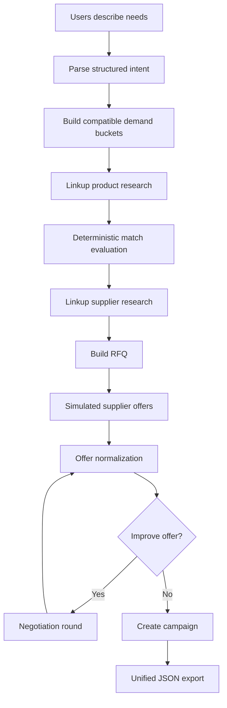

# SYE — agentic demand aggregation MVP

**Demand-first group buying.** Instead of a retailer picking a product and hunting for
buyers, people describe what they actually need in their own words. The system turns each
request into structured requirements, groups the people whose *hard* requirements a single
product could satisfy, researches real products for that group, checks every candidate
against every binding requirement, finds plausible suppliers, aggregates the demand into
one RFQ, negotiates in simulation, and publishes a complete campaign — with a full audit
trail explaining why each person ended up in each group and why each product was chosen.

The demo category is computer monitors, but the architecture is category-generic:
requirements are `key / operator / value` triples and only
[`domain/vocabulary.py`](src/sye/domain/vocabulary.py) knows what a monitor is.

> **Everything commercial in demo mode is simulated.** Supplier offers, negotiations and
> campaign prices are produced by a seeded simulator. Product and supplier research can be
> live web data (Linkup), and every web-derived object keeps its source URLs. No supplier
> is ever contacted, no order is placed, no payment is processed.

---

## Architecture



### The agents

Each phase with real autonomous work is owned by exactly one agent. Agents own their
decisions, their tools and their audit trail, and each can be run on its own.

| Agent | Owns | Decides |
| --- | --- | --- |
| `IntentAgent` | ingestion | what a person actually meant; requirement vs wish; what to assume rather than block on |
| `MarketResearchAgent` | **group bucketing + market research** | who can be served by one product; what to ask the web; whether to search again; which candidates fit |
| `SourcingAgent` | supply | which companies could plausibly fulfil this; what terms to request |
| `NegotiationAgent` | commercial | what to counter with and against whom; when a deal is good enough |
| `CampaignAgent` | publication | which offer wins; whether there is a deal worth publishing |

Single-purpose helpers (parse a request, judge compatibility, query the web, draft
copy) live in `src/sye/agents/tools/`; they perform one action, agents decide when to
use them. The LangGraph pipeline wires the agents together and owns the renegotiation
cycle — it contains no reasoning of its own, and each node is a thin adapter over an
agent method.

Three rules shape the whole codebase:

1. **Typed data between every stage.** Nodes read and write canonical Pydantic models from
   [`src/sye/domain/models.py`](src/sye/domain/models.py) — never prose.
2. **Deterministic logic where determinism is possible.** Prices, ranges, feasibility,
   scores, thresholds and winner selection are plain Python. The LLM handles language:
   interpretation, semantic tie-breaks, explanations and negotiation copy.
3. **Everything is traceable.** Every decision emits an audit event with input/output IDs,
   a concise reason, a confidence and its sources. Model chain-of-thought is never stored.

---

## Setup

```bash
uv sync
cp .env.example .env               # then add ANTHROPIC_API_KEY and/or LINKUP_API_KEY
uv run python scripts/check_env.py # shows what is configured (never prints a secret)
uv run python scripts/check_env.py --probe   # one real Linkup call, to verify the key
```

`.env` is read from the working directory, so run commands from the repository root.
It is gitignored. A key can also be supplied per shell — `export LINKUP_API_KEY=...` —
which `uv run` passes through.

The pipeline runs **without any API key**: intent parsing, explanations and negotiation
copy fall back to a deterministic rule engine, and product/supplier research falls back to
the local fixture catalogue in [`data/fixtures/`](data/fixtures). Every audit event and the
run metrics record which engine actually produced each object, so a keyless run is never
mistaken for a live one.

| Variable | Purpose |
| --- | --- |
| `LLM_PROVIDER` / `LLM_MODEL` | `anthropic` (default, `claude-opus-5`) or `openai` |
| `ANTHROPIC_API_KEY` / `OPENAI_API_KEY` | enables LLM-backed extraction and copy |
| `LINKUP_API_KEY` | enables live web research (`--live`) |
| `LINKUP_DEFAULT_DEPTH` | `standard` (default) or `deep` |
| `LINKUP_MAX_CALLS_PER_RUN` | hard cap on research calls per run (default 20) |
| `SYE_OFFLINE` | default research mode (`true` = fixtures) |
| `SYE_SEED` | simulation seed (default 42) |
| `SYE_DB_URL` | SQLite URL (default `sqlite:///data/sye.db`) |
| `SYE_CORS_ORIGINS` | comma-separated frontend origins |
| `LANGSMITH_TRACING` | optional tracing; the demo never depends on it |

---

## Demo

```bash
uv run python scripts/run_demo.py examples/demo_easy.json --verbose
```

Other scenarios and modes:

```bash
uv run python scripts/run_demo.py examples/users_monitors.json          # spec sample
uv run python scripts/run_demo.py examples/demo_edge_cases.json         # graceful degradation
uv run python scripts/run_demo.py examples/demo_scale.json              # 12 buyers
uv run python scripts/run_demo.py --scenario easy --live                # live Linkup research
uv run python scripts/run_demo.py --replay data/demo_runs/<run_id>/final.json
```

Each run writes an inspectable directory:

```text
data/demo_runs/<run_id>/
  01_input.json  02_intents.json  03_buckets.json  04_products.json
  05_matches.json  06_suppliers.json  07_rfqs.json  08_offers_round_1.json
  09_offers_final.json  10_campaigns.json
  final.json            # the canonical PipelineRunExport
  audit.json            # ordered audit events
  lovable_payload.json  # frontend-safe projection (plain JSON only)
  report.md             # operator-readable run report
```

`--replay` re-renders any `final.json` without making a single LLM or Linkup call.

---

## Running one agent on its own

The market research & group bucketing agent has its own entry point: JSON in, demand
buckets and researched candidates out, with no suppliers, negotiation or campaign.

```bash
uv run python scripts/run_market_research.py examples/users_named.json            # fixtures
uv run python scripts/run_market_research.py examples/users_named.json --live     # real web
uv run python scripts/run_market_research.py examples/demo_easy.json --live --verbose
```

It accepts any of these input shapes:

```jsonc
{"users": {"john doe": "27 inch 1440p with USB-C charging, under €320", "jane doe": "..."}}
{"users": [{"user_id": "john doe", "prompt": "..."}]}
{"users": ["27 inch 1440p with USB-C charging, under €320", "..."]}
```

and prints, per bucket: the members, the requirements that bind the group, the exact
query sent to the web, every candidate with its verdict and evidence, and the best
item match. The typed result is written to
`data/demo_runs/<run_id>/market_research.json`.

`--live` requires `LINKUP_API_KEY`; without it the run stops with an error rather than
quietly falling back to fixtures.

## API

```bash
uv run uvicorn sye.main:app --reload --port 8000
```

```bash
# start a run from a scenario body (synchronous; returns the full export)
curl -s -X POST http://localhost:8000/api/v1/demo/runs \
  -H 'content-type: application/json' \
  -d @examples/demo_easy.json | jq '.run_id, .status, .metrics.campaigns_created'

# or launch a built-in scenario with one call (handy for a UI button)
curl -s -X POST http://localhost:8000/api/v1/demo/scenarios/easy/run | jq '.run_id'

curl -s http://localhost:8000/api/v1/demo/runs/<run_id>          | jq '.campaigns[0]'
curl -s http://localhost:8000/api/v1/demo/runs/<run_id>/events   | jq '.[].message'
curl -s http://localhost:8000/api/v1/demo/runs/<run_id>/export   > run.json
curl -s http://localhost:8000/api/v1/demo/runs/<run_id>/lovable  > lovable.json
curl -s http://localhost:8000/api/v1/campaigns                   | jq '.[].title'
curl -s http://localhost:8000/api/v1/schema/pipeline-run         > pipeline-run.schema.json
```

| Endpoint | Returns |
| --- | --- |
| `POST /api/v1/demo/runs` | runs a scenario, returns `PipelineRunExport` |
| `GET /api/v1/demo/runs` | stored run summaries |
| `GET /api/v1/demo/runs/{run_id}` | `PipelineRunExport` |
| `GET /api/v1/demo/runs/{run_id}/events` | ordered `AuditEvent[]` |
| `GET /api/v1/demo/runs/{run_id}/export` | same export, download-friendly |
| `GET /api/v1/demo/runs/{run_id}/lovable` | frontend-safe projection + views |
| `GET /api/v1/demo/runs/{run_id}/report` | markdown run report |
| `GET /api/v1/demo/runs/{run_id}/stream` | SSE of public audit events |
| `GET /api/v1/demo/scenarios` | built-in scenarios |
| `POST /api/v1/demo/scenarios/{key}/run` | run a built-in scenario |
| `GET /api/v1/campaigns`, `GET /api/v1/campaigns/{id}` | campaign objects |
| `GET /api/v1/schema/pipeline-run`, `GET /api/v1/schema/campaign` | JSON Schema for typed frontend interfaces |

`PipelineRunExport` is the single frontend contract: every view in a Lovable UI is
derivable from it. Money serialises as JSON numbers, timestamps as ISO-8601 strings and
enums as plain strings — no custom decoding needed.

---

## The demo web app

```bash
uv run uvicorn sye.main:app --port 8000     # then open http://localhost:8000
```

A single page that shows the agents working. Paste a JSON object of customer
requests — the key is a name or email, the value is what that person actually
wrote — press **Run the agents**, and it renders:

1. **Buying groups** — who was grouped with whom, the requirements that bind each
   group (most-shared first), and, per member, which requirements they inherited
   from someone else.
2. **What each customer wrote, and what the agent understood** — their own words
   beside the structured requirements extracted from them.
3. **What the agents did** — the recorded decision trail, agent by agent.

```json
{
  "anna@example.com": "I want a smart ring that tracks my sleep and HRV. No monthly subscription please. Under €300.",
  "ben@example.com": "Looking for a sleep tracking ring, works with my iPhone, at least a week of battery. Max €320.",
  "eva@example.com": "Fitness band with GPS and heart rate for running, waterproof, around €200."
}
```

It runs the ingestion and grouping half of the pipeline only — parse intents, then
group. That takes about 25 ms, needs no API key, and touches no external service, so
the page answers instantly. Product research and negotiation are the slow half and
stay behind the CLI and the run API.

The page is plain HTML, CSS and JavaScript served by FastAPI from
[`src/sye/web/`](src/sye/web/) — no build step, no dependencies, nothing to install.

---

## Connecting a Lovable frontend

Full guide: [frontend/README.md](frontend/README.md). TypeScript types for the entire
payload plus a small client: [frontend/sye.ts](frontend/sye.ts) — copy it into your
project as `src/lib/sye.ts`.

### Path A — static payload (no backend to host)

Best for a demo. Build the whole UI against a real run, then switch to live by changing
one line.

```bash
uv run python scripts/run_demo.py examples/demo_easy.json
# → data/demo_runs/<run_id>/lovable_payload.json   (~200 KB of plain JSON)
```

Add that file to the Lovable project as `src/data/run.json`:

```ts
import type { LovablePayload } from "@/lib/sye";
import raw from "@/data/run.json";

const run = raw as unknown as LovablePayload;

run.views.campaign_cards;    // storefront grid, fully denormalised
run.views.user_journeys;     // "why am I in this group", per person
run.views.bucket_summaries;  // how each group formed
run.views.timeline;          // how it was decided
```

### Path B — live API

```ts
import { createSyeClient } from "@/lib/sye";

const sye = createSyeClient(import.meta.env.VITE_SYE_API_URL);

const run = await sye.runScenario("easy");          // one-click demo
const run = await sye.run({                          // or your own users
  users: {
    "john doe": "I need a 27 inch 1440p monitor that charges over USB-C, under €320",
    "jane doe": "At least 27 inches, QHD, for spreadsheets. Around €280",
  },
  offline: false,   // research the live web with Linkup
});
```

Both `POST /api/v1/demo/runs` and `POST /api/v1/demo/scenarios/{key}/run` accept
`?format=lovable`, which returns the export with `views` already attached — one request,
one render. `users` accepts a `{name: prompt}` mapping, a list of objects, or a list of
bare prompts.

### Two things to get right

**CORS is an explicit allowlist, never `*`.** Add your origins and restart the API:

```bash
SYE_CORS_ORIGINS=http://localhost:5173,https://your-project.lovable.app
```

**A hosted Lovable page cannot reach `http://localhost:8000`** — the page is https, so
the browser blocks the plaintext request. It looks like a CORS bug but is not. Either
develop against Lovable's local dev server, or expose the API over https:

```bash
cloudflared tunnel --url http://localhost:8000     # prints an https URL
```

### Keep the simulation label

Every campaign carries `pricing.simulated: true` and `data_origin: "simulated"`. The
backend never presents a simulated offer as real; the UI is where that guarantee is
easiest to lose. Show a visible "simulated pricing — not a supplier commitment" label on
every card.

---

## Tests

```bash
uv run pytest          # 89 tests: unit + end-to-end, no network required
uv run pytest -m live  # opt-in: real Linkup queries (needs LINKUP_API_KEY)
make lint
```

`tests/test_market_research_agent.py` runs the bucketing + research agent end to end
(ingest → buckets → research → verdicts → best match), including its decision to
search again with a broadened query when nothing fits.
`tests/test_linkup_client.py` exercises the live Linkup code path against the SDK's own
response models with only the HTTP call replaced; the `live`-marked test in
`test_market_research_agent.py` is the one that actually hits the web.

---

## What is simulated and what is not

| Data | Origin | Marked as |
| --- | --- | --- |
| User requests | the scenario file | `user` |
| Structured intents | LLM or rule engine | `llm_inferred` / `system` |
| Demand buckets, matches, scores | deterministic Python | computed, fully explained |
| Products & suppliers (live run) | Linkup web research | `web_research` + source URLs |
| Products & suppliers (offline run) | `data/fixtures/*.json` | `system` + `fixture://` URLs |
| Supplier offers, negotiations, campaign prices | seeded simulator | `simulated` |

Offline fixtures are never substituted silently for a failed live search: a failing live
research branch produces a warning and a `partial` run.

---

## Limitations

- One category vocabulary (monitors); other categories bucket separately but have no
  attribute dictionary yet.
- Bucketing is greedy and order-stable, not globally optimal clustering.
- Negotiation economics are simulated; the live supplier gateway intentionally raises
  rather than pretending outreach happened.
- No authentication, payments, inventory reservation or fulfilment — see
  [`CLAUDE.md`](CLAUDE.md) for the non-goals.
